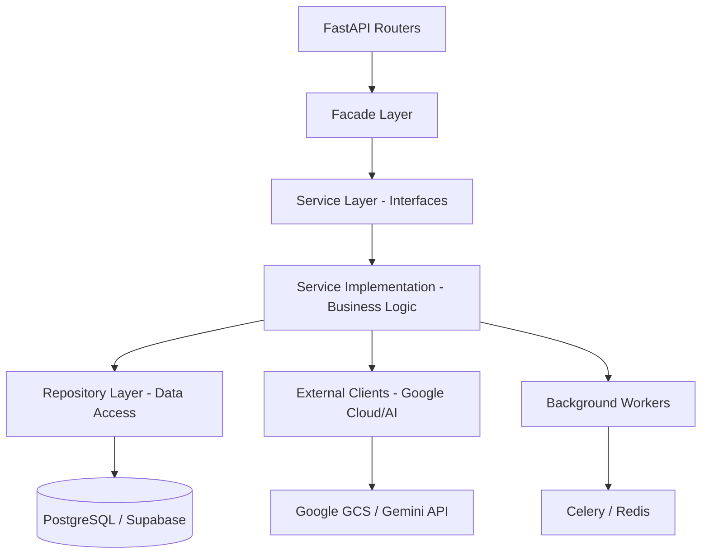

# TALMA Backend - Extracción y Automatización con IA

Backend robusto diseñado para la extracción, anonimización y procesamiento inteligente de guías aéreas utilizando IA Generativa (Google Gemini).

## Arquitectura del Sistema

El backend sigue una arquitectura por capas (**Layered Architecture**) inspirada en principios de *Clean Architecture* para asegurar la separación de responsabilidades y facilidad de prueba.



### Componentes Clave:
- **Router Layer**: Definición de endpoints y validación de entrada con Pydantic.
- **Facade Layer**: Punto de entrada unificado que orquesta llamadas a múltiples servicios y simplifica la interfaz para los controladores.
- **Service Layer**: Lógica de negocio pura. Incluye el motor de chat de **Sarah** (Copilot) y el procesador de documentos.
- **Repository Layer**: Acceso a datos y persistencia, aislando el ORM de la lógica de negocio.

## Stack Tecnológico

- **Framework**: FastAPI (Asíncrono)
- **Base de Datos**: PostgreSQL + SQLAlchemy (ORM) + asyncpg
- **IA/ML**: Google GenAI SDK
- **Procesamiento Asíncrono**: Celery + Redis
- **Infraestructura**: Docker, Google Cloud Platform (GCS)
- **Seguridad**: JWT (HS256) + OAuth2

## Requisitos y Configuración

### 1. Variables de Entorno
Crea un archivo `.env` en la raíz con las siguientes claves:
- `DATABASE_URL`: Conexión a PostgreSQL.
- `LLM_API_KEY`: API Key de Google AI Studio.
- `LLM_MODEL_NAME`: Modelo para la extracción de data.
- `COPILOT_LLM_MODEL_NAME`: Modelo para Sarah.
- `REDIS_URL`: URL del servidor Redis.
- `ACCESS_TOKEN_EXPIRE_MINUTES`: Tiempo de expiración del token.
- `SECRET_KEY`: Clave secreta para el token.
- `ALGORITHM`: Algoritmo de encriptación.
- `PASWORD_INICIAL`: Contraseña inicial.
- `SMTP_HOST`: Host de correo.
- `SMTP_PORT`: Puerto de correo.
- `SMTP_USER`: Usuario de correo.
- `SMTP_PASSWORD`: Contraseña de correo.
- `GCS_BUCKET_NAME`: Bucket de Google Cloud Storage.
- `GCP_PROJECT_ID`: ID del proyecto de Google Cloud.
- `GCP_CLIENT_EMAIL`: Correo del cliente de Google Cloud.
- `GCP_PRIVATE_KEY`: Clave privada de Google Cloud.
- `CELERY_TASK_QUEUE`: Cola de tareas de Celery.


### 2. Ejecución Local (Desarrollo)

Requiere una instancia de Redis corriendo:
```bash
docker run --name redis-talma -p 6379:6379 -d redis
```

Ejecutar Workers de Celery:
```bash
celery -A core.internal.celery_app worker --loglevel=info --pool=solo
```

Ejecutar Servidor API:
```bash
uvicorn main:app --reload
```

## Estructura del Proyecto

- `app/api/routers`: Endpoints de la API.
- `app/core/services`: Lógica de negocio e interfaces.
- `app/core/repository`: Acceso a datos.
- `app/core/domain`: Modelos de dominio y DTOs.
- `config`: Configuración global y orquestación de rutas.
- `utl`: Utilidades y constantes del sistema.
